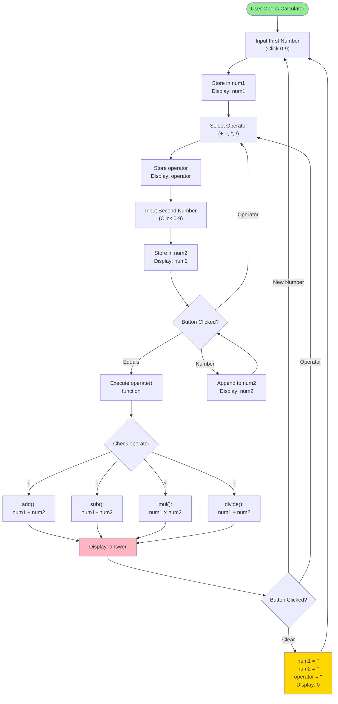

# Odin Calculator

A simple, interactive web-based calculator built with vanilla HTML, CSS, and JavaScript. Perfect for basic arithmetic operations with a clean, modern user interface.

## Features

- **Basic Arithmetic**: Supports addition (+), subtraction (-), multiplication (*), and division (/)
- **Clean UI**: Responsive grid-based button layout with an intuitive display
- **Real-time Display**: Shows current input and calculation results instantly
- **Clear Function**: Reset calculator with the 'C' button
- **Modern Design**: Dark theme with rounded buttons and smooth interactions

## Project Structure

```
odin-Calculator/
├── index.html      # HTML structure for the calculator
├── style.css       # Styling and layout
├── script.js       # JavaScript logic and event handling
├── README.md       # This file
```

## How It Works

1. **Input Numbers**: Click number buttons (0-9) to enter the first number
2. **Select Operation**: Click an operator button (+, -, *, /)
3. **Input Second Number**: Click number buttons to enter the second number
4. **Calculate**: Click the equals button (=) to see the result
5. **Clear**: Click the 'C' button to reset and start over

## Flow Diagram



## Architecture

### JavaScript Functions

- **`grid()`**: Creates the 4×4 button grid and initializes event listeners
- **`add()`**: Performs addition
- **`sub()`**: Performs subtraction
- **`mul()`**: Performs multiplication
- **`divide()`**: Performs division
- **`operate(num1, num2)`**: Routes to the appropriate operation based on selected operator

### State Variables

- `num1`: Stores the first operand
- `num2`: Stores the second operand
- `operator`: Stores the selected operation
- `answer`: Stores the calculation result

## Usage

Simply open `index.html` in your web browser to start using the calculator.

```bash
# No installation required!
# Just open in your browser:
open index.html
```

## Technical Details

- **Grid Layout**: 4×4 button grid (16 buttons total)
- **Button Size**: 64×64px each
- **Display**: 640px wide, shows real-time input and results
- **Color Scheme**: Dark blue background with teal accent buttons

## Future Improvements

- [ ] Add decimal point support
- [ ] Support for chained operations (e.g., 5 + 3 - 2 =)
- [ ] Keyboard input support
- [ ] History log of calculations
- [ ] Error handling for division by zero
- [ ] Scientific calculator functions

## Author

Created as part of The Odin Project curriculum.

## License

Open source - feel free to use and modify!